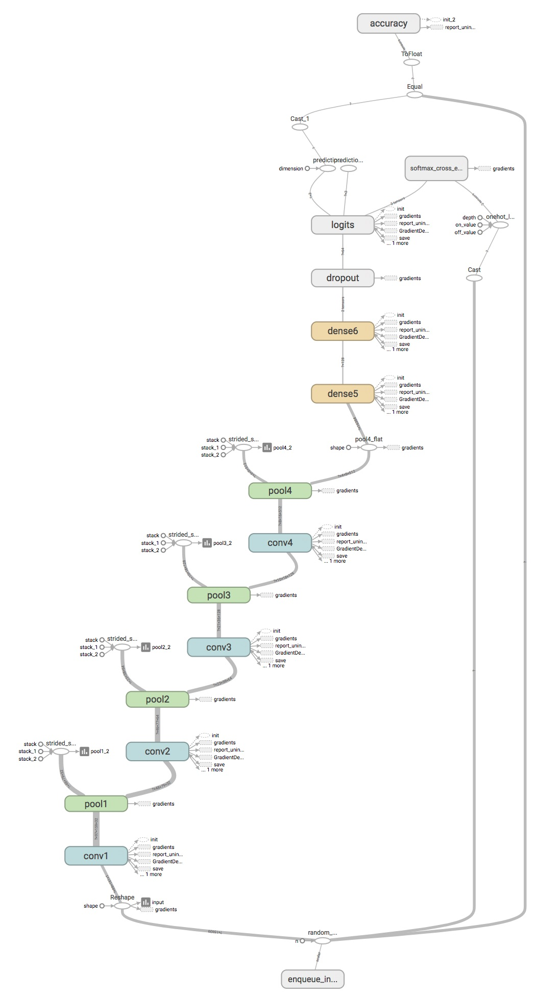
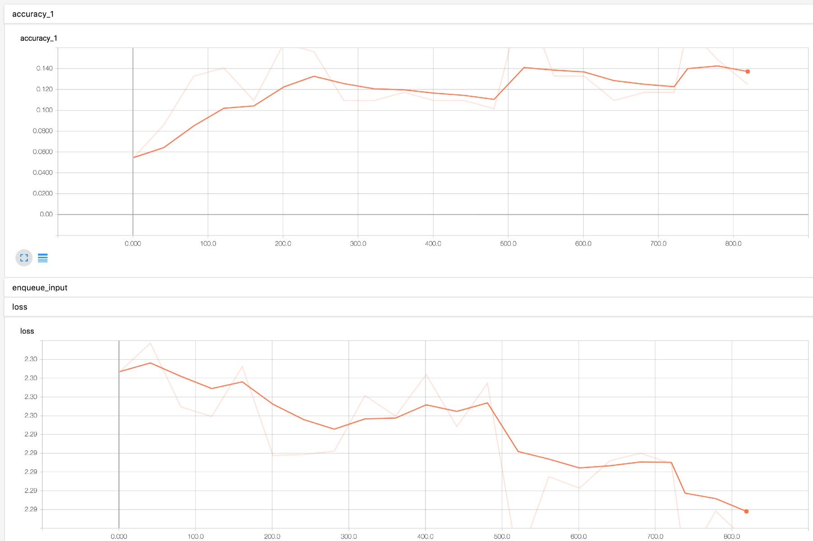
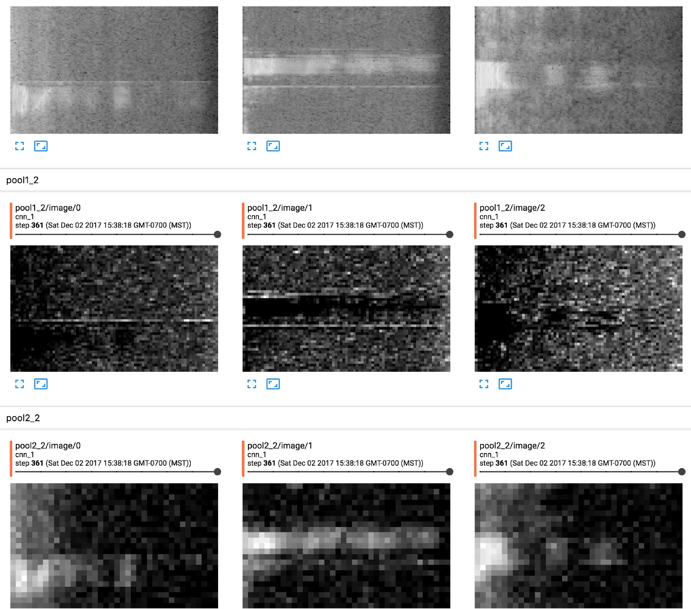

# TensorFlow Speech Recognition Challenge

 > Can you build an algorithm that understands simple speech commands?
 
### What is this?

My attempt at [Kaggle's TensorFlow speech recognition challenge](https://www.kaggle.com/c/tensorflow-speech-recognition-challenge)

### Home grown architecture

 * Convolution layers: 3x3 kernels with valid padding
 * Max pool layers: 2x2 with stride 2
 * First convolution layer: 32 filters
 * Subsequent convolution layers double number of filters
 * Dropout layer: trained at 0.4
 * First fully connected layer: 128 units
 * Second fully connected layer: 64 units

| layer    | output shape   | parameters |
| -------- | -------------- | ---------- |
| conv1    | (97, 159, 32)  | 320
| pool1    | (97, 159, 32)  | 0
| conv2    | (46, 77, 64)   | 576
| pool2    | (23, 38, 64)   | 0
| conv3    | (21, 36, 128)  | 1,152
| pool3    | (10, 18, 128)  | 0
| conv4    | (8, 16, 512)   | 4,608
| pool4    | (4, 8, 512)    | 0
| flat     | (16384)        | 0
| dense4   | (128)          | 2,097,280
| dense5   | (64)           | 8,256
| softmax  | (10)           | 650
| TOTAL    |                | 2,112,842

### Learning progress

### Who am I?

[https://www.kaggle.com/formigone](https://www.kaggle.com/formigone)